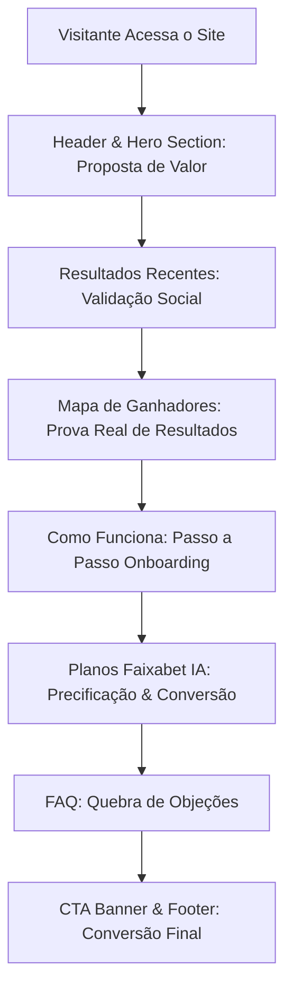

# Software Design Document (SDD) — Faixabet Frontend

Este documento de especificação técnica descreve os padrões visuais, arquitetura de componentes da Home page, e o design detalhado do novo módulo interativo da landing page institucional do site **faixabet.com.br**.

---

## 1. Visão Geral e Objetivos

O site institucional atua como a principal camada de atração e aquisição de usuários (topo de funil) da plataforma FaixaBet. Ele tem o objetivo de converter visitantes em assinantes recorrentes por meio de demonstração de valor (Inteligência Artificial de alta precisão integrada a análises probabilísticas).

O objetivo deste documento é oficializar os padrões visuais, tokens e a arquitetura de componentes construída no arquivo `index-2.html` com foco principal na nova seção **Como Funciona**.

---

## 2. Design System & Identidade Visual

A interface do FaixaBet adota uma estética digital de alta performance ("Cyber-stunning / Premium Dark Mode") baseada em contrastes elevados, painéis em glassmorphism e realces luminosos.

### 🎨 Paleta de Cores (Tailwind CSS Config)
*   **Background Dark**: `#0f172a` (Slate muito escuro que compõe a cor estrutural de fundo).
*   **Surface Dark**: `#1e293b` (Slate intermediário utilizado em cards e painéis).
*   **Primary (Realce Principal)**: `#135bec` (Electric Blue - Usado para realce de marca, CTAs e links ativos).
*   **Accent Green**: `#00d26a` (Verde neon - Usado em indicações de sucesso, resultados oficiais e premiações).
*   **Accent Purple**: `#8b5cf6` (Roxo elétrico - Usado em botões premium, selos de elite e realces graduais).
*   **Accent Yellow**: `#fcd535` (Amarelo vibrante - Usado em troféus, notificações de destaque e estrelas).
*   **Accent Orange**: `#f97316` (Laranja energético - Usado em badges temporários e componentes de aviso).

### ✍️ Tipografia
*   **Fontes do Sistema**: Montserrat & Space Grotesk.
    -   *Montserrat* é utilizada para elementos de exibição e cabeçalhos de alta importância corporativa para manter peso e presença de marca.
    -   *Space Grotesk* é adotada para textos informativos, parágrafos, numerações estatísticas e tabelas, oferecendo leitura clara, visual digital futurista e altíssima escaneabilidade.
*   **Material Symbols Outlined**: Utilizada como a biblioteca de ícones padronizada e unificada para o frontend, mantendo espessura consistente e suporte nativo a preenchimentos vetoriais baseados em gradientes em tempo de renderização.

---

## 3. Arquitetura da Home Page (`index-2.html`)

A página é estruturada por meio de componentes de fluxo lógico que guiam o visitante através do funil de conversão:

### Detalhamento das Seções:
1.  **Header (Global Navigation)**: Cabeçalho com transparência de fundo, logo vibrante e navegação em âncoras internas. Inclui o controle dinâmico para acesso ao aplicativo oficial.
2.  **Hero Section**: Apresentação de valor do sistema de IA (algoritmo fAIxaBet v9.165) acoplado a chamadas interativas para palpites rápidos gratuitos.
3.  **Resultados Oficiais**: Exibição dos últimos sorteios das loterias (Mega-Sena, Lotofácil, Lotomania, Quina) de forma automatizada por carregamento dinâmico via JS.
4.  **Mapa de Ganhadores**: Mapa de calor interativo baseado em dados geográficos de ganhadores de concursos, provendo transparência corporativa.
5.  **Como Funciona (Nova Seção)**: Onboarding visual focado em etapas independentes com cards interativos.
6.  **Planos de Assinatura**: Matriz de acessibilidade e cotas de palpites baseada em planos (Free, Silver, Gold).
7.  **FAQ**: Central de suporte interna estruturada sob acordeões semânticos.
8.  **Footer**: Rodapé de navegação, termos legais e aviso de limite etário (+18 anos).

---

## 4. Especificação Técnica da Seção "Como Funciona"

A seção `#como-funciona` foi projetada sob diretrizes avançadas de UX/UI para separar visualmente as etapas por meio de cards independentes de alto padrão visual.

### 📐 Layout & Grid
*   **Container**: `py-12 border-t border-white/5 relative overflow-hidden`.
*   **Grid de Cards**: Grid responsivo com 4 colunas em desktops, 2 colunas em tablets e 1 coluna em dispositivos móveis (`grid grid-cols-1 md:grid-cols-2 lg:grid-cols-4 gap-6`).

### 📦 Estrutura de Cards Independentes

Cada etapa do passo a passo possui um card independente com a seguinte estrutura de classes e comportamento visual:

1.  **Container Principal do Card**:
    *   *Classe*: `bg-surface-dark/40 border border-white/5 rounded-2xl p-6 relative overflow-hidden transition-all duration-300 hover:-translate-y-1 group flex flex-col justify-between h-full`.
    *   *Hover Glow*: Adoção de sombra neon e bordas coloridas dinâmicas personalizadas por etapa.
2.  **Glow Radial de Fundo**:
    *   Um elemento absoluto posicionado no fundo do card (`absolute -bottom-20 -right-20 size-40 rounded-full blur-3xl opacity-0 group-hover:opacity-100 transition-opacity duration-500`) aciona uma iluminação suave quando o usuário passa o mouse sobre o card.
3.  **Numeração Dinâmica Flutuante**:
    *   *Classe*: `absolute top-4 right-4 text-slate-700/10 text-6xl font-extrabold select-none font-display group-hover:text-primary/10 transition-colors`.
    *   *Comportamento*: Atua como marca d'água elegante indicando o número da etapa (`01`, `02`, `03`, `04`).
4.  **Container e Estilo de Ícones**:
    *   *Classe*: `w-14 h-14 rounded-2xl bg-gradient-to-br border flex items-center justify-center mb-6 transition-all duration-300 group-hover:scale-110 shadow-lg`.
    *   *Ícone*: Utiliza a biblioteca `Material Symbols Outlined` com classe gradiente que remove o preenchimento sólido do texto e aplica preenchimento baseado no gradiente de realce (`bg-clip-text bg-gradient-to-r text-transparent`).

### 📑 Mapeamento Técnico de Etapas

| Etapa | Título | Subtítulo / Badge | Descrição | Ícone (Material Symbols) | Cores de Destaque / Hover Border |
| :--- | :--- | :--- | :--- | :--- | :--- |
| **01** | **Escolha seu plano** | `Etapa 1` / `primary` | Escolha o nível de palpites que atenda à sua banca. Comece no plano Free, evolua no Silver ou domine com o Gold. | `payments` | **Electric Blue** (`primary`) / `hover:border-primary/30` |
| **02** | **Registre-se** | `Etapa 2` / `accent-purple` | Crie sua conta informando apenas os dados básicos para validação segura, sem burocracias e em menos de 1 minuto. | `person_add` | **Accent Purple** / `hover:border-accent-purple/30` |
| **03** | **Acesse o App** | `Etapa 3` / `accent-green` | Explore seu painel personalizado contendo seu histórico de palpites gerados, concursos salvos e o status ativo do plano. | `rocket_launch` | **Accent Green** / `hover:border-accent-green/30` |
| **04** | **Gere palpites com IA** | `Etapa 4` / `accent-yellow` | Execute o processamento estatístico estatuto-neural para que a IA gere dezenas otimizadas baseadas em padrões reais. | `auto_awesome` | **Accent Yellow** / `hover:border-accent-yellow/30` |

### 🔗 Fluxo de CTA
Um botão centralizado no final da seção (`Quero Começar Agora`) convida o usuário a rolar suavemente até o id `#planos-faixabet` (`href="#planos-faixabet"`), fechando o ciclo de onboarding com a tomada de decisão comercial imediata.
